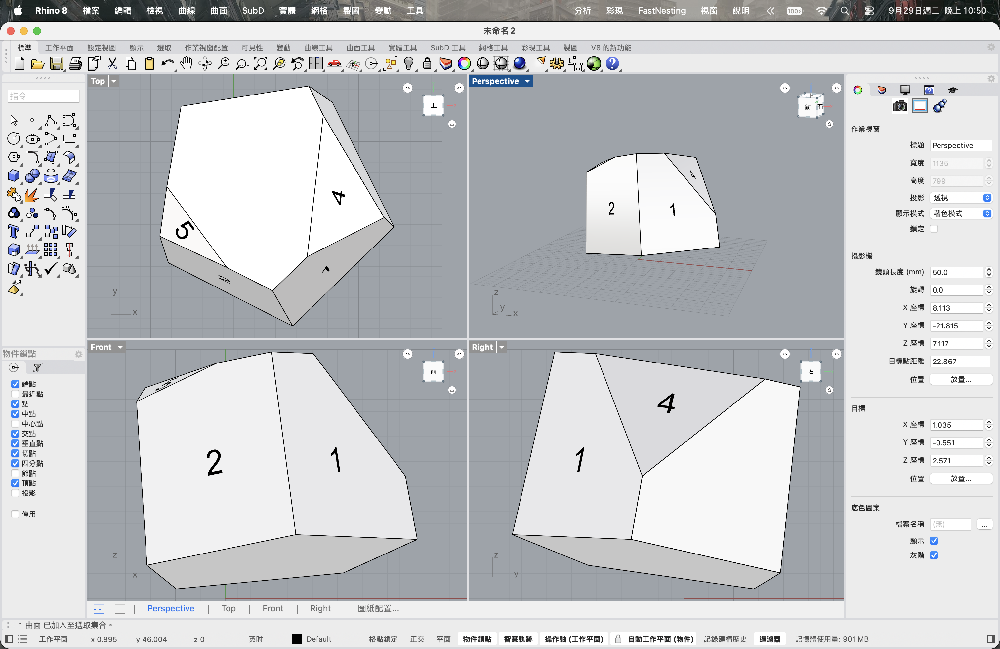

# ononSmartView

**Rhino 8 視圖導覽外掛** · [English](README.md)



ononSmartView 是以 C# / RhinoCommon 開發的外掛，可正視 Brep 面、讓攝影機配合 Rhino 目前的工作平面，並透過輕量 ViewCube 導覽。專案以 .NET 8 和 AnyCPU 為目標，不使用 WPF 或 Windows Forms。

> **測試版本：功能尚未完整，仍有疏漏與未驗證之處。** 外掛曾在 macOS Rhino 8.35 測試；Windows Yak 套件已建置，但尚未在 Windows Rhino 實際測試。請勿用於正式生產工作，重要模型請先備份。

## 功能

- 選取 Brep 面後設定工作平面，並以動畫切換至平行正視。優先使用平面；曲面會依選取點建立切線座標框架。
- `ononSmartViewBack` 還原正視前記錄的攝影機、投影、目標點、鏡頭與工作平面；`ononSmartViewFlip` 翻轉正視方向。
- ViewCube 支援點選面、邊、角切換視角、拖曳旋轉、水平轉 90°，以及重設。Perspective 重設會回到本次 ViewCube 操作前記錄的視角；標準視圖則回復預設方向並重新取景。
- 圓形 **C** 按鈕用來開關自動正對工作平面。按鈕只切換設定，點擊時不會移動攝影機。開啟後，從下一次工作平面變動開始跟隨，包含物件與世界工作平面；透視視窗會維持透視投影，方便使用操作軸。外掛不會更改 Rhino 的自動工作平面偏好設定。

## 指令

| 指令 | 說明 |
| --- | --- |
| `ononSmartView` | 選取 Brep 面並正視。 |
| `ononSmartViewBack` | 還原正視前的攝影機與工作平面。 |
| `ononSmartViewFlip` | 翻轉正視方向。 |
| `ononSmartViewCube` | 顯示或隱藏 ViewCube。 |
| `ononSmartViewAutoFace` | 開關攝影機正對目前工作平面；與圓形 C 按鈕相同。 |
| `ononSmartViewFocusFace` | 腳本用正視指令，依序輸入 Brep GUID、面索引與視窗名稱。 |

## macOS 安裝

1. 下載 [ononSmartView.macrhi](ononSmartView.macrhi)。
2. 使用 Rhino 8 開啟 `.macrhi` 安裝套件；若有提示，請重新啟動 Rhino。
3. 若已安裝舊版 `SmartView`，請先移除，以免重複顯示 ViewCube 或同時監聽自動工作平面。

安裝套件未簽署，macOS 安全性設定可能會要求你確認是否載入。

## Windows 安裝

Windows 版本以 AnyCPU 和 .NET 8 為目標。下載 [ononsmartview-0.1.0-beta-rh8_35-win.yak](ononsmartview-0.1.0-beta-rh8_35-win.yak)，並用 Rhino 8 隨附的 Yak 命令列工具安裝：

```powershell
& "$env:ProgramFiles\Rhino 8\System\yak.exe" install "C:\path\to\ononsmartview-0.1.0-beta-rh8_35-win.yak"
```

安裝後重新啟動 Rhino。此套件適用於 Windows Rhino 8.35 以上版本。若無法使用 Yak，請下載[手動載入檔](ononSmartView-windows-manual.zip)並解壓縮；將兩個檔案放在同一資料夾，再使用 Rhino 的 `PlugInManager` 指令安裝／載入 `ononSmartView.rhp`。

## 編譯

需求：安裝 Rhino 8（含 RhinoCommon）與 .NET 8 SDK。

```sh
dotnet build ononSmartView.csproj -c Release
```

Windows 編譯請使用 Rhino 8 的 `System/RhinoCommon.dll`。`scripts/build-windows.ps1` 會編譯外掛並產生 Rhino 8 Windows `.yak` 套件與手動載入檔。

## 測試與限制

冒煙測試腳本會在 Rhino 建立方盒與斜面，供手動檢查；不會自動選面或驗證攝影機狀態。macOS Rhino 8.35 中已透過 Rhino MCP，在停用舊版外掛後驗證 C 開關。Windows 執行情況與最新的曲面軸向校準仍需在 Rhino 內確認。這是測試版本，部分功能與說明可能尚不完整或準確，後續也可能因修正問題而調整。

## 授權

目前尚未指定授權，預設保留所有權利。重新散布或修改前請先聯絡作者。
